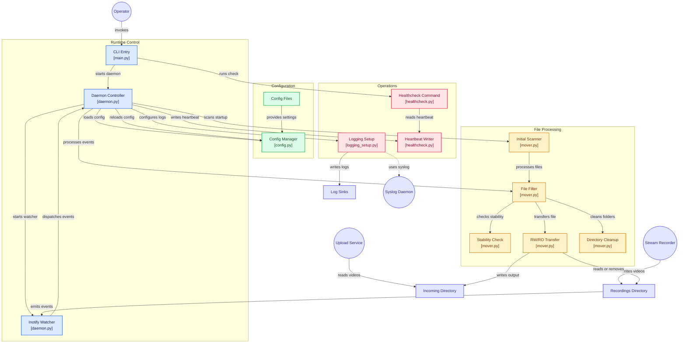

# 🏗️ Architektur

Dieses Dokument beschreibt den Aufbau von `fetchbridge` auf Modulebene: welche Komponente was tut und wie Quell-/Zielverzeichnis, Konfiguration und Healthcheck zusammenspielen. Für Betriebsanleitungen (Docker, Pfade, `fetchbridge.conf`) siehe [README.md](README.md).

## Überblick

## Komponenten

### Entry and Daemon

- **`main.py`** — argparse-CLI mit `-D`/`--daemon` (startet den Dauerbetrieb) und `--healthcheck` (prüft nur die Heartbeat-Datei und beendet sich sofort, für Docker `HEALTHCHECK`). Konfiguriert bewusst noch kein Logging: das würde bereits für `--healthcheck`/`--version` einen stdout-Handler ohne Datei-Erkennung fest einrichten, obwohl diese Aufrufe kein Logging brauchen — `setup_logging()` läuft daher erst innerhalb von `run_daemon()`.
- **`daemon.py`** — `run_daemon()` lädt die Konfiguration, validiert `SOURCE_DIR`/`TARGET_DIR` (`_ensure_source_dir_ready()`/`_ensure_target_dir_ready()` — in einem Container muss es sich um ein echtes Docker-Volume handeln, nicht nur um das vom Dockerfile per `mkdir -p` angelegte Verzeichnis, sonst würden verarbeitete Dateien beim nächsten Neustart unbemerkt verloren gehen), führt einen initialen Scan (`scan_existing_files()`) durch und startet danach einen `InotifyTree`-Watch (nur `IN_CLOSE_WRITE`/`IN_MOVED_TO`, um keine Selbst-Events durch das eigene `cleanup_empty_dirs()` zu erzeugen). Die äußere `while True`-Schleife um `event_gen()` ist notwendig, weil dessen Idle-Timeout ohne sie den gesamten Prozess mit Exit-Code 0 beenden würde, sobald mal länger keine Datei ankommt. Config-Änderungen werden per Hash-Vergleich erkannt und hot-reloaded — außer bei einer Änderung von `source_dir`, die einen Neustart erfordert, da `InotifyTree` fest an seinen Startpfad gebunden ist.

### Configuration and Logs

- **`config.py`** — liest `fetchbridge.conf` und alphabetisch sortiert alle `conf.d/*.conf` ein, mit Fallback auf Environment-Variablen pro Einstellung. `get_config_hash()` bildet die Grundlage für das Hot-Reload im Daemon. `_is_dedicated_mount()` unterscheidet per `st_dev`-Vergleich zwischen einem echten Docker-Volume/Bind-Mount und einem vom Image nur fest angelegten Verzeichnis; `_running_in_container()` erkennt die Container-Umgebung zuverlässig über `/.dockerenv`.
- **`logging_setup.py`** — richtet das Logging (Konsole/Datei) anhand der geladenen Konfiguration ein, inklusive einer INFO-Zusammenfassung, welches Log-System gerade aktiv ist.

### File Processing

- **`mover.py`** — enthält den gesamten Verarbeitungspfad:
  - `scan_existing_files()` — initialer Scan von `SOURCE_DIR` beim Start, damit bereits vorhandene Dateien nicht auf ein Inotify-Event warten müssen.
  - `is_file_stable()` — vergleicht die Dateigröße über die Zeit, um sicherzustellen, dass eine Datei nicht mehr von einem anderen Prozess (z. B. `tw-recorder`s FFmpeg-Remux) beschrieben wird; zusätzliche Absicherung neben der Watch-Maske für Flush-Close-Reopen-Verhalten oder verzögerte Events auf Netzwerk-Mounts.
  - `process_file()` — lehnt Symlinks explizit ab (sonst wäre ein Symlink mit erlaubter Endung ein Primitive für beliebigen Dateizugriff über `shutil.copy2`/`shutil.move`), filtert Temp-/versteckte Dateien und nicht unterstützte Endungen, löst Namenskollisionen im Ziel auf (`video_1.mp4`), und entscheidet dann zwischen Verschieben (RW-Quelle) und Kopieren (RO-Quelle, per `is_writable()`-Prüfung auf das Elternverzeichnis).
  - `_move_file()` — versucht zuerst einen atomaren `os.rename()`; schlägt der fehl (z. B. `EXDEV` bei unterschiedlichen Mounts), wird explizit auf Kopieren+Löschen zurückgefallen und der konkrete Fehlschlag-Grund geloggt, statt das (wie `shutil.move()`) stillschweigend zu tun.
  - `cleanup_empty_dirs()` — räumt nach einem erfolgreichen Verschieben (nur RW, nur wenn `CLEANUP_EMPTY_DIRS` aktiv ist) rekursiv leer gewordene Unterverzeichnisse unterhalb von `SOURCE_DIR` auf, bis zur Quellwurzel selbst oder zum ersten nicht-leeren Verzeichnis.

### Health and Storage

- **`healthcheck.py`** — `write_heartbeat()` wird bei jedem verarbeiteten Event und bei jedem Idle-Zyklus des Daemons aufgerufen; `check_healthcheck()` (CLI: `--healthcheck`) prüft als eigener kurzlebiger Prozess nur Existenz und Alter der Heartbeat-Datei, unabhängig vom laufenden Daemon — erkennt damit sowohl tote als auch hängende (deadlocked) Prozesse.
- **Source `/srv/media-pipeline/recordings`** — Quellverzeichnis, typischerweise von einem vorgelagerten Tool (z. B. `tw-recorder`) befüllt.
- **Target `/srv/media-pipeline/incoming`** — Zielverzeichnis, aus dem nachgelagerte Tools (z. B. `yt-upload`) Dateien übernehmen.
- **Heartbeat-Datei** — von `healthcheck.py` geschrieben/gelesen, Grundlage für `--healthcheck` und Docker/Kubernetes-Liveness-Probes.

## Einordnung in die Medien-Pipeline

`fetchbridge` ist das Bindeglied zwischen `tw-recorder` (schreibt fertige Aufnahmen nach `/srv/media-pipeline/recordings`) und `yt-upload` (verarbeitet neue Dateien aus `/srv/media-pipeline/incoming`) — die RW/RO-Erkennung erlaubt dabei, `/srv/media-pipeline/recordings` je nach Setup entweder als gemeinsames beschreibbares Volume oder als read-only-Mount einzubinden, ohne dass sich am Verhalten von `fetchbridge` etwas ändert.
